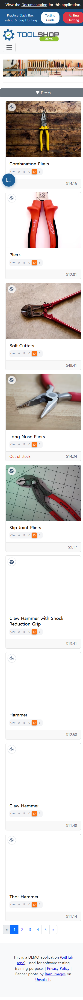

# ISSUE-002: 모바일 뷰포트에서 상품 가격 텍스트 잘림

- **심각도**: P3 Minor
- **카테고리**: 반응형 / UI
- **발견 일시**: 2026-05-06
- **URL**: https://practicesoftwaretesting.com/
- **재현 조건**: 뷰포트 375×812 (모바일)

## 현상
모바일(375px) 뷰포트에서 상품 가격이 잘려서 표시됨.
예: "Combination Pliers" 가격 $14.15 → "$14.5" 로 표시됨 (소수점 이하 마지막 자리 누락)

## 예상 동작
모든 뷰포트에서 가격이 완전하게 표시되어야 함. ($14.15)

## 재현 방법
1. 브라우저 뷰포트를 375px로 설정
2. https://practicesoftwaretesting.com/ 접속
3. 첫 번째 상품(Combination Pliers) 가격 확인 → "$14.5"로 잘려서 표시

## 스크린샷

## 비고
- CSS `overflow: hidden` 또는 컨테이너 width 부족으로 인한 텍스트 클리핑 추정
- 결제 관련 금액 표시에 영향을 줄 수 있어 수정 권고
