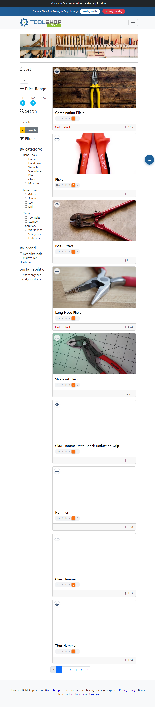

# ISSUE-003: 페이지 로드 시 JavaScript 콘솔 에러 3건 발생

- **심각도**: P2 Major
- **카테고리**: 기능 / 성능
- **발견 일시**: 2026-05-06
- **URL**: https://practicesoftwaretesting.com/ (전 페이지 공통)
- **재현 조건**: 모든 뷰포트, 모든 페이지

## 현상
사이트의 모든 페이지 로드 시 JavaScript 콘솔에 에러 3건이 지속적으로 발생.
로그인 페이지에서는 추가로 warning 1건 발생.

## 예상 동작
정상적인 프로덕션 배포에서 콘솔 에러가 없어야 함.

## 재현 방법
1. https://practicesoftwaretesting.com/ 접속
2. 브라우저 개발자 도구 Console 탭 확인
3. 에러 3건 확인됨

## 스크린샷

## 비고
- Playwright MCP 콘솔 로그: `.playwright-mcp/console-*.log` 참조
- 콘솔 에러는 사용자에게 직접 노출되지 않지만, 잠재적 기능 오동작의 원인이 될 수 있음
- 에러 내용 상세 분석 및 수정 필요
