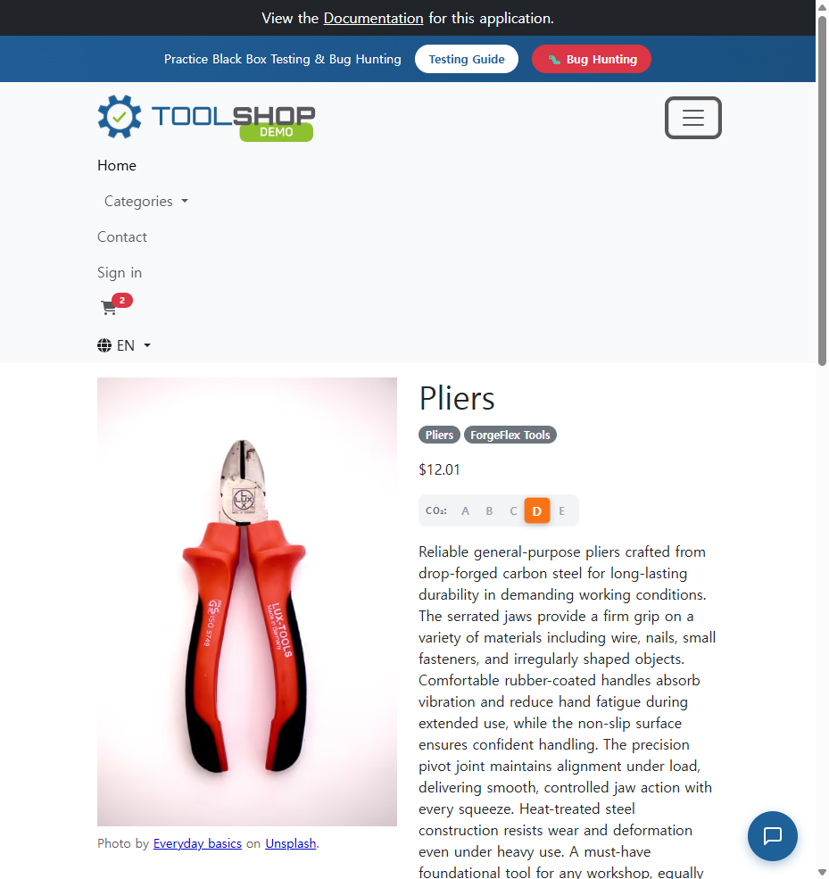

# ISSUE-004: 소형 뷰포트에서 장바구니 아이콘이 햄버거 메뉴 내부에만 표시

- **심각도**: P3 Minor
- **카테고리**: UX / 반응형
- **발견 일시**: 2026-05-06
- **URL**: https://practicesoftwaretesting.com/ (전체)
- **재현 조건**: 뷰포트 < 1280px (모바일, 태블릿)

## 현상
모바일/태블릿 뷰포트에서 장바구니 아이콘(카트 뱃지 포함)이 햄버거 메뉴를 열어야만 확인 가능.
상품을 담아도 헤더에서 즉시 확인 불가 → 사용자가 장바구니 상태를 인지하기 어려움.

## 예상 동작
반응형 레이아웃에서도 장바구니 아이콘 + 수량 뱃지는 항상 헤더에 고정 노출되어야 함.
(참고: 데스크톱 1280px에서는 헤더에 항상 표시됨 ✅)

## 재현 방법
1. 뷰포트를 375px로 설정 후 사이트 접속
2. 상품 상세 → "Add to cart" 클릭
3. 헤더에 카트 아이콘/뱃지가 보이지 않음
4. 햄버거 메뉴 클릭 시에만 카트 아이콘(뱃지 포함) 확인 가능

## 스크린샷

## 비고
- 모바일 e-commerce UX에서 장바구니 접근성은 핵심 요소
- 헤더 fixed 영역에 cart 아이콘 별도 배치 권고
